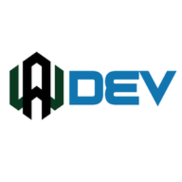

<p align="center"> 
  


</p>


  <h3 align="center">AWDEV CORPORATION</h3>

  <p align="center">
AWDEV FREE OPPEN SOURCE GENERAL TO PROJECTS DEVOLOPER , DESIGNER , AND PROGRAMER  <br/>
    Note This Project Is Still @AWDEV
    <br/>
    <br/>
    <a href="https://www.awdev.my.id"><strong>View Demo »</strong></a>
    <br/>
    <br/>
    <a href="https://www.awdev.my.id/GitHub-Finder/index.html">Github Finder</a>
    .
    <a href="https://www.awdev.my.id/home.html ">Page Projects</a>
    .
    <a href="https://www.awdev.my.id/android/vc/index.html">Visual Code</a>
    .
    <a href="https://www.awdev.my.id/youtube/downloader.html">Youtube Downloader</a>
    .
    <a href="https://www.awdev.my.id/thema">Templates</a>    
    .
    <a href="https://blog.awdev.my.id/">Blog</a>    
  
</p>
</p>


## Table Of Contents

- [HOME PAGE](https://www.awdev.my.id)
- [The Project](https://www.awdev.my.id/home.html)
- [Github Finder](https://www.awdev.my.id/GitHub-Finder/index.html)
- [Android](https://www.awdev.my.id/android)
  - [AUTO](https://www.awdev.my.id/android/auto)
  - [Converter](https://www.awdev.my.id/android/auto/convert.html)
  - [Rools](https://www.awdev.my.id/android/auto/rools.html)
  - [Kode Post](https://www.awdev.my.id/android/kodepost)
  - [Screenshot](https://www.awdev.my.id/android/screen/index.html)
  - [Visual Code](https://www.awdev.my.id/android/vc/index.html)
  - [Editor Code](https://www.awdev.my.id/android/vc/editor.html)
  - [Character](https://www.awdev.my.id/android/character.html)
  - [Android Asset](https://www.awdev.my.id/android/index.html)
  - [EQ Generator](http://www.awdev.my.id/android/EQ/index.html)
  - [APP Privasy Generator](https://www.awdev.my.id/android/privasy/index.html)
  - [AWDEV STUDIO](www.awdev.my.id/android/studio/index.html)
- [Thema](https://www.awdev.my.id/thema)
  - [AMP 1 ⚡](https://www.awdev.my.id/thema/amp/v1.html)
  - [AMP 2 ⚡](https://www.awdev.my.id/thema/amp/v2.html)
  - [ARSHA](https://www.awdev.my.id/thema/arsha/index.html)
  - [ATOM](https://www.awdev.my.id/thema/atom/index.html)
  - [LANDING](https://www.awdev.my.id/thema/landing/index.html)
  - [MOBILE](https://www.awdev.my.id/thema/mobile/index.html)
  - [⚡ AMP MOBILE](https://www.awdev.my.id/thema/mobile/amp.html)
  - [ADMIN DASHBOARD](https://www.awdev.my.id/thema/pages/dashboard.html)
  - [SIGN IN](https://www.awdev.my.id/thema/pages/sign-in.html)
  - [SIGN UP](https://www.awdev.my.id/thema/pages/sign-up.html)
  - [VIRTUAL REALITY](https://www.awdev.my.id/thema/pages/virtual-reality.html)
  - [BILLING](https://www.awdev.my.id/thema/pages/billing.html)
  - [RTL](https://www.awdev.my.id/thema/rtl.html)
  - [Index](https://www.awdev.my.id/thema/index.html)
- [FILE](https://www.awdev.my.id/file)
  - [NFT AWDEV COLLECTION](https://www.awdev.my.id/file/index.html)
- [AR ( Augmented Reality )](https://www.awdev.my.id/ar/)
  - [WEB AR VIEWVER](https://www.awdev.my.id/ar/index.html)
  - [WEB AR NFT](https://www.awdev.my.id/ar/nft.html)
- [VR ( Virtual Reality )](https://www.awdev.my.id/vr/)
  - [excample](https://www.awdev.my.id/vr/examples/)
  - [littleplanet image](https://www.awdev.my.id/vr/examples/littleplanet_image.html)
  - [panomoment linking](https://www.awdev.my.id/vr/examples/panomoment_linking.html)
  - [panorama basic](https://www.awdev.my.id/vr/examples/panorama_basic.html)
  - [panorama camera](https://www.awdev.my.id/vr/examples/panorama_camera.html)
  - [panorama cube](https://www.awdev.my.id/vr/examples/panorama_cube.html)
  - [panorama googlestreetview](https://www.awdev.my.id/vr/examples/panorama_googlestreetview.html)
  - [panorama image](https://www.awdev.my.id/vr/examples/panorama_image.html)
  - [panorama infospot](https://www.awdev.my.id/vr/examples/panorama_infospot.html)
  - [panorama infospot focus](https://www.awdev.my.id/vr/examples/panorama_infospot_focus.html)
  - [panorama interactive](https://www.awdev.my.id/vr/examples/panorama_interactive.html)
  - [panorama linking](https://www.awdev.my.id/vr/examples/panorama_linking.html)
  - [panorama loading progress](https://www.awdev.my.id/vr/examples/panorama_loading_progress.html)
  - [panorama memoryleak test](https://www.awdev.my.id/vr/examples/panorama_memoryleak_test.html)
  - [panorama reticle](https://www.awdev.my.id/vr/examples/panorama_reticle.html)
  - [panorama simple gallery](https://www.awdev.my.id/vr/examples/panorama_simple_gallery.html)
  - [panorama stereo image](https://www.awdev.my.id/vr/examples/panorama_stereo_image.html)
  - [panorama stereo vidio](https://www.awdev.my.id/vr/examples/panorama_stereo_video.html)
  - [panorama storytelling](https://www.awdev.my.id/vr/examples/panorama_storytelling.html)
  - [panorama video](https://www.awdev.my.id/vr/examples/panorama_video.html)
- [QR ( Quick Response )](https://qr.awdev.my.id)
  - [View Web QR](https://qr.awdev.my.id/v3)
- [YOUTUBE](https://youtube.com/channel/UCyp-Fn_0Ek4_aXIFbcWaq0w)
  - [SUBCRIBE](https://youtube.com/channel/UCyp-Fn_0Ek4_aXIFbcWaq0w)
  - [YOUTUBE DOWNLOADER](https://www.awdev.my.id/youtube/downloader.html)
- [SEARCH](http://www.awdev.my.id/search/)
  - [CSE](http://www.awdev.my.id/search/cse.html)
  - [Crypto](http://www.awdev.my.id/search/crypto/index.html)
  - [Buy APP Crypto](https://www.paypal.com/cgi-bin/webscr?cmd=_s-xclick&hosted_button_id=82DLHDSRV7J68)
  - [Github Profile Repo](http://www.awdev.my.id/search/github/index.html)
- [BLOOG](http://www.awdev.my.id/blog)
  - [BLOOG 1](https://blog.awdev.my.id/)
  - [BLOOG 2](https://blog.awdev.my.id/)
- [urls.cfg](http://www.awdev.my.id/urls.cfg)
- [SITEMAP](https://www.awdev.my.id/sitemap.txt)
- [FAQ](https://www.awdev.my.id/faq.html)
- [PRIVASY](https://www.awdev.my.id/privasy.html)
- [404](https://www.awdev.my.id/404.html)

- [Wiki](https://github.com/awdevmyid/awdevmyid.wiki.git)
- [Pull Requests](https://github.com/awdevmyid/awdevmyid/pulls)
- [License](LICENSE)
- [SECURITY](SECURITY.md)
- [Authors](#authors)
- [Inovasi](https://www.paypal.com/invoice/p/#KABVQRFBGDMQCPJ6)
- [Sponsored](https://github.com/sponsors/wahyu9kdl)
- [Acknowledgements](#acknowledgements)

## INSTAL

GITHUB CLI
```
gh repo clone awdevmyid/awdevmyid.github.io
```
HTTP/HTTPS

```
https://github.com/awdevmyid/awdevmyid.github.io.git
```
ZIP
```
https://github.com/awdevmyid/awdevmyid.github.io/archive/refs/heads/main.zip
```
# SERVICE

OPPEN ON THIS SITE

[https://www.awdev.my.id](https://www.awdev.my.id)

[https://qr.awdev.my.id](https://qr.awdev.my.id)

[https://blog.awdev.my.id](https://blog.awdev.my.id)

[https://go.awdev.my.id](https://go.awdev.my.id)

[https://app.awdev.my.id](https://app.awdev.my.id)

[https://ide.awdev.my.id](https://ide.awdev.my.id)

## Paypal Link

https://www.paypal.com/webapps/billing/plans/subscribe?plan_id=P-8MU20167P66356111MYMSC5Q

https://www.paypal.com/webapps/billing/plans/subscribe?plan_id=P-0KC8311077154863SMZQ3EDA

https://www.paypal.com/webapps/billing/plans/subscribe?plan_id=P-8MU20167P66356111MYMSC5Q

https://www.paypal.com/webapps/billing/plans/subscribe?plan_id=P-4WF80797503132036MIXUZVI

https://www.paypal.com/webapps/billing/plans/subscribe?plan_id=P-0GU49296UP065262SMJOC6PY

https://www.paypal.com/webapps/billing/plans/subscribe?plan_id=P-36X28874YK702584EMZQ4KSY

Thank you for your support and thank you for your donation. This means a lot to us.


Started Now

https://www.paypal.com/webapps/billing/plans/subscribe?plan_id=P-8MU20167P66356111MYMSC5Q


## Sponsor this project

[@wahyu9kdl](https://github.com/sponsors/wahyu9kdl)
https://paypal.me/wahyudi9kdl
https://trakteer.id/awfanspage/tip
https://saweria.co/AwGroupChannel
