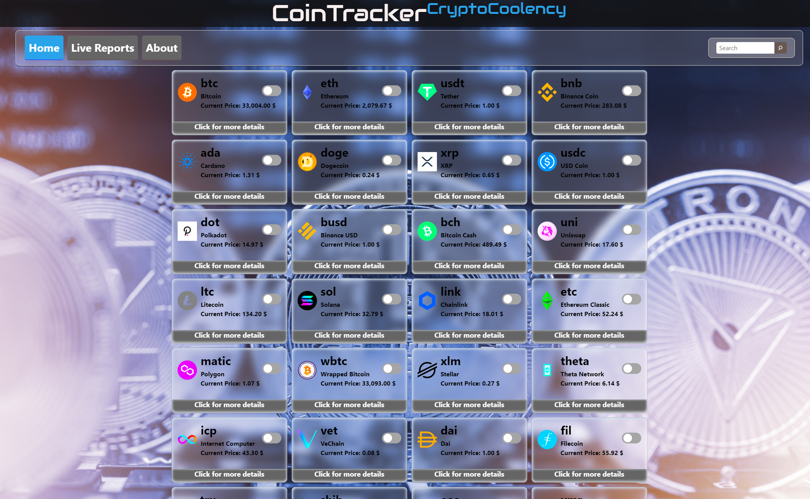
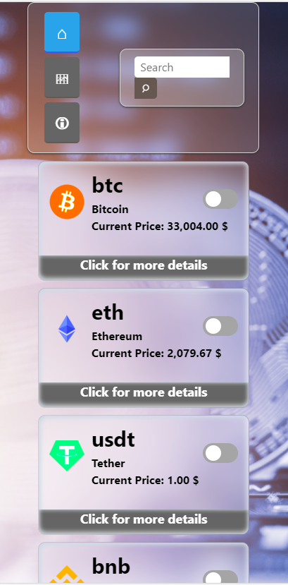
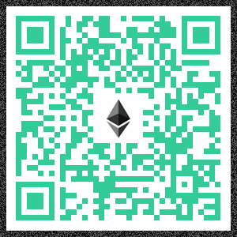

# CoinTracker
## CoinTracker Dashboard 

Technology used in the project
- HTML
- CSS
- JavaScript
- JQuery&Ajax

Libraries used in the project
- Bootstrap
- Font Awsome
- Pace.js
- Canvas.js

## API USED In this project

[CoinGecko API] provides data for live pricing, trading volume, tickers, exchanges, historical data, coin info & images, developer & community stats, events, global markets, and CoinGecko Beam coins & exchanges status updates directly.

[CryptoCompare API] is the independent global cryptocurrency market data provider, giving institutional and retail investors access to real-time, high-quality, reliable market and pricing data. A central authority for clear and concise information, CryptoCompare offers unrivalled breadth, scope and depth of data, bridging the gap between the crypto asset and traditional financial markets.

## Dynamic Content
The content on the webapp will adjust dynamically or in real-time according to users requests. Different users may see different content in some cases.

The purpose of this dashboard is to demonstrate how to produce dynamic content only at the request of the user. In addition there is no need to send requests to the server unnecessarily, so the webapp works in such a way that if 2 minutes have not passed no new request is sent to the server. Also, just by clicking on more information a request is sent to the server for extended currency information.

## Link to the project:
 [View on Github pages]
 
 ## Preview:
 
  

## Moblie:

    
   
 

[//]: # (These are reference links used in the body of this note and get stripped out when the markdown processor does its job. There is no need to format nicely because it shouldn't be seen. Thanks SO - http://stackoverflow.com/questions/4823468/store-comments-in-markdown-syntax)

   [CoinGecko API]: <https://www.coingecko.com/en>
   
   [CryptoCompare API]: <https://www.cryptocompare.com/>
   
   [View on Github pages]: <https://www.awdev.my.id/search/crypto/>
   
  
# Donation Projects
   
   
   
   
   
   
   
   
   
